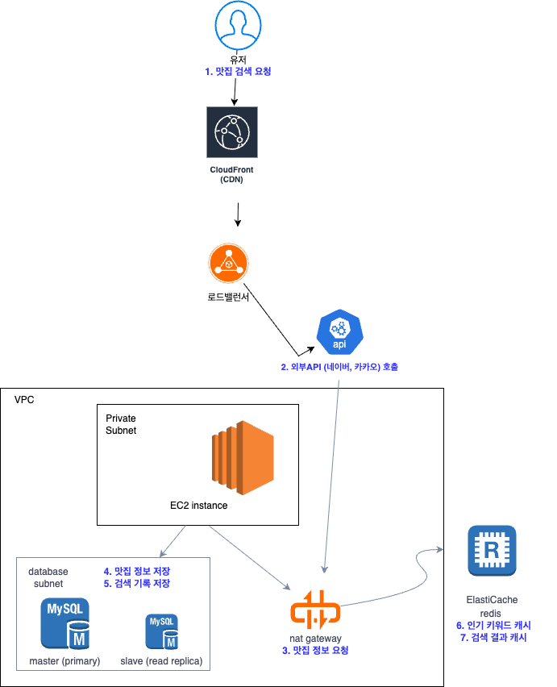

# 맛집 검색 서비스 요구사항 명세서

---

## 프로젝트 개요

**목표**: 오픈 API를 이용한 맛집 검색 서비스 구현
- 키워드를 이용해 맛집을 검색할 수 있는 서비스
- 인기 키워드 제공을 통해 사람들이 관심 있는 맛집 트렌드 파악

---

## 요구사항 분석

### 기능적 요구사항 (Functional Requirements)

#### 1. 맛집 검색 API
**기능**: 키워드와 지역정보를 이용한 맛집 정보 검색

- **검색 기능**: 키워드 기반 맛집 검색
- **필터링**: 지역정보를 이용한 검색 결과 필터링
- **정렬**: 정확도순, 리뷰 개수순 정렬 지원
- **페이지네이션**: 검색 결과 페이징 처리
- **외부 API 연동**: 네이버 지역검색 API(기본), 카카오 로컬 API(확장)

#### 2. 인기 키워드 API
**기능**: 사용자들이 많이 검색한 키워드 조회

- **인기 키워드 조회**: 상위 10개 키워드 제공
- **검색 횟수 제공**: 각 키워드별 검색 횟수 함께 응답
- **검색 기록 수집**: 사용자 검색 시 키워드 저장 및 집계

#### 3. 카테고리 기능 (심화)
**기능**: 지역 기반 카테고리별 인기 키워드 제공

- **지역별 분류**: 강남, 홍대, 정자, 성수 등 지역 카테고리
- **H2 코드 색인**: H2 기반 검색 결과 색인 구현

### 비기능적 요구사항 (Non-Functional Requirements)

#### 가용성(Availability)
- **외부 API 장애 대응**: 외부 API 장애 시 다른 API로 Failover
- **서비스 연속성**: 일부 기능 장애 시에도 핵심 기능 유지
- **Circuit Breaker**: 장애 전파 방지 및 자동 복구

#### 성능(Performance)
- **검색 응답 시간**: 외부 API 호출 포함 3초 이내 응답
- **인기 키워드 조회**: 캐시 활용으로 100ms 이내 응답
- **비동기 처리**: 검색 기록 저장이 검색 성능에 영향 최소화
- **대용량 처리**: 일일 수십만 건의 검색 기록 처리 가능

#### 확장성(Scalability)
- **수평 확장**: 서버 인스턴스 추가로 처리량 증대 가능
- **새로운 검색 소스**: 플러그인 방식으로 검색 API 추가 용이
- **지역 확장**: 새로운 지역 카테고리 동적 추가 가능

#### 신뢰성(Reliability)
- **데이터 정확성**: 키워드 검색 빈도 집계의 정확성 보장
- **트랜잭션 보장**: 검색 기록 저장의 원자성 보장
- **일관성**: 인기 키워드 캐시와 실제 데이터 간 일관성 유지

#### 보안(Security)
- **API 키 보안**: 외부 API 키의 안전한 저장 및 관리
- **Rate Limiting**: API 호출 빈도 제한으로 남용 방지
- **입력 검증**: SQL Injection, XSS 등 보안 취약점 방지

#### 운영성(Operability)
- **모니터링**: 외부 API 상태, 시스템 메트릭, 비즈니스 메트릭 추적
- **로깅**: 검색 패턴, 에러 상황 등 운영에 필요한 로그 기록
- **알림**: 외부 API 장애, 시스템 이상 상황 시 알림

#### 품질(Quality)
- **테스트 커버리지**: 모든 핵심 기능에 대한 단위 테스트 작성
- **코드 품질**: Clean Architecture와 SOLID 원칙 준수
- **TDD**: 테스트 우선 개발 방식 적용

---

## 상세 기능 명세

### API 엔드포인트

#### 1. 맛집 검색 API
```http
GET /api/restaurants/search
```

**요청 파라미터**
- `keyword` (필수): 검색 키워드
- `location` (선택): 지역 정보
- `sort` (선택): 정렬 방식 (`accuracy`, `review_count`)
- `page` (선택): 페이지 번호 (기본값: 1)
- `size` (선택): 페이지 크기 (기본값: 10)

**응답 예시**
```json
{
  "restaurants": [
    {
      "name": "맛있는 갈비집",
      "category": "한식 > 육류,고기요리",
      "address": "서울특별시 강남구 ...",
      "phone": "02-123-4567",
      "rating": 4.5,
      "reviewCount": 128
    }
  ],
  "totalCount": 50,
  "currentPage": 1,
  "hasNext": true
}
```

#### 2. 인기 키워드 API
```http
GET /api/keywords/popular
```

**요청 파라미터**
- `category` (선택): 지역 카테고리 (강남, 홍대 등)

**응답 예시**
```json
{
  "keywords": [
    {
      "keyword": "갈비집",
      "count": 1234
    },
    {
      "keyword": "파스타",
      "count": 987
    }
  ]
}
```
---

## ERD 다이어그램
ERD.md 파일을 참조하세요. (바로가기: [ERD.md](ERD.md))

### 🔄 핵심 데이터 플로우 설명

### 1. 검색 프로세스
**SEARCH_REQUEST** → **SEARCH_RESULT** → **RESTAURANT**  
(검색 요청 → 결과 → 맛집 정보)

### 2. 키워드 분석 프로세스
**SEARCH_REQUEST** → **SEARCH_RECORD** → **KEYWORD**  
(검색 요청 → 기록 → 키워드)

### 3. 비동기 이벤트 처리
**SEARCH_REQUEST** → **SEARCH_EVENT**  
(검색 요청 → 비동기 이벤트)

### 4. 키워드 집계 관계

- **KEYWORD** → **KEYWORD_COUNT** (키워드별 검색 횟수 집계)
- **KEYWORD** → **POPULAR_KEYWORD** (인기 키워드 스냅샷)

### 5. 지역 기반 분류

**LOCATION_CATEGORY**가 다음 테이블들을 지역별로 분류:
- **KEYWORD_COUNT**
- **POPULAR_KEYWORD**
- **SEARCH_RECORD**

### 6. 외부 API 관리

**EXTERNAL_API_CONFIG** → **API_CALL_LOG**  
(API 설정 → 호출 로그)


---

## 외부 API 연동

### 네이버 지역검색 API (기본)
- **URL**: `https://openapi.naver.com/v1/search/local.json`
- **문서**: https://developers.naver.com/docs/serviceapi/search/local/local.md
- **인증**: Client ID/Secret
- **제한**: 일일 25,000회

### 카카오 로컬 API (확장)
- **URL**: `https://dapi.kakao.com/v2/local/search/keyword.json`
- **문서**: https://developers.kakao.com/docs/latest/ko/local/dev-guide#search-by-keyword
- **인증**: REST API Key
- **제한**: 월간/일간 쿼터

---

## 프로젝트 구조 (DDD 기반)

```
com.restaurant.search
├── restaurant
│   ├── controller
│   │   └── RestaurantController.java
│   ├── service
│   │   ├── RestaurantSearchService.java
│   │   └── RestaurantSearchServiceImpl.java
│   ├── repository
│   │   └── RestaurantRepository.java
│   ├── domain
│   │   ├── Restaurant.java
│   │   ├── SearchRequest.java
│   │   ├── SearchResult.java
│   │   └── SortType.java
│   └── dto
│       ├── RestaurantSearchRequest.java
│       └── RestaurantSearchResponse.java
├── keyword
│   ├── controller
│   │   └── KeywordController.java
│   ├── service
│   │   ├── KeywordService.java
│   │   ├── KeywordServiceImpl.java
│   │   └── KeywordCountService.java
│   ├── repository
│   │   ├── KeywordRepository.java
│   │   └── SearchRecordRepository.java
│   ├── domain
│   │   ├── Keyword.java
│   │   ├── KeywordCount.java
│   │   ├── SearchRecord.java
│   │   └── PopularKeyword.java
│   └── dto
│       └── PopularKeywordResponse.java
├── external
│   ├── client
│   │   ├── SearchApiClient.java
│   │   ├── NaverLocalApiClient.java
│   │   └── KakaoLocalApiClient.java
│   ├── config
│   │   ├── NaverApiConfig.java
│   │   └── KakaoApiConfig.java
│   └── dto
│       ├── naver
│       │   ├── NaverSearchRequest.java
│       │   ├── NaverSearchResponse.java
│       │   └── NaverSearchItem.java
│       └── kakao
│           ├── KakaoSearchRequest.java
│           ├── KakaoSearchResponse.java
│           └── KakaoDocument.java
├── search
│   ├── service
│   │   ├── SearchEventService.java
│   │   └── SearchEventServiceImpl.java
│   ├── event
│   │   ├── SearchEvent.java
│   │   └── SearchEventHandler.java
│   └── strategy
│       ├── SearchStrategy.java
│       ├── FailoverSearchStrategy.java
│       └── AggregatedSearchStrategy.java
└── common
    ├── config
    │   ├── AsyncConfig.java
    │   ├── CacheConfig.java
    │   ├── CircuitBreakerConfig.java
    │   └── WebConfig.java
    ├── exception
    │   ├── GlobalExceptionHandler.java
    │   ├── ExternalApiException.java
    │   ├── SearchException.java
    │   └── KeywordException.java
    ├── util
    │   ├── CoordinateConverter.java
    │   └── HtmlTagRemover.java
    └── constant
        └── ApiConstants.java
```

### 주요 도메인 구조 설명

#### Restaurant 도메인
- **핵심 책임**: 맛집 정보 검색 및 관리
- **주요 엔티티**: Restaurant, SearchRequest, SearchResult
- **외부 의존성**: 네이버/카카오 API 클라이언트

#### Keyword 도메인
- **핵심 책임**: 검색 키워드 추적 및 인기 키워드 제공
- **주요 엔티티**: Keyword, KeywordCount, SearchRecord
- **이벤트 처리**: 검색 이벤트 수신하여 키워드 카운트 업데이트

#### External 패키지
- **핵심 책임**: 외부 API 연동 및 데이터 변환
- **설계 원칙**: Strategy 패턴으로 다중 API 지원
- **장애 처리**: Circuit Breaker 및 Failover 구현

#### Search 패키지
- **핵심 책임**: 검색 이벤트 처리 및 검색 전략 관리
- **비동기 처리**: 검색 기록 저장 및 키워드 집계
- **확장성**: 새로운 검색 전략 추가 용이

## 개발 우선순위

### Phase 1 (MVP)
1. Restaurant 도메인 - 기본 검색 기능
2. External 패키지 - 네이버 API 클라이언트
3. Keyword 도메인 - 검색 기록 저장 및 인기 키워드
4. Search 패키지 - 검색 이벤트 처리
5. 카테고리 기능 - 지역 정보 기반 필터링

### Phase 2 (확장)
1. External 패키지 - 카카오 API 추가 및 Failover
2. Search 패키지 - 다중 검색 전략 구현
3. Common 패키지 - Circuit Breaker 및 캐싱

### Phase 3 (심화)
1. Keyword 도메인 - 지역 기반 카테고리 기능
2. Restaurant 도메인 - H2 기반 검색 결과 색인
3. 성능 최적화 및 모니터링

---

## 배포 (AWS)
(바로가기: [aws.png](aws.png))
